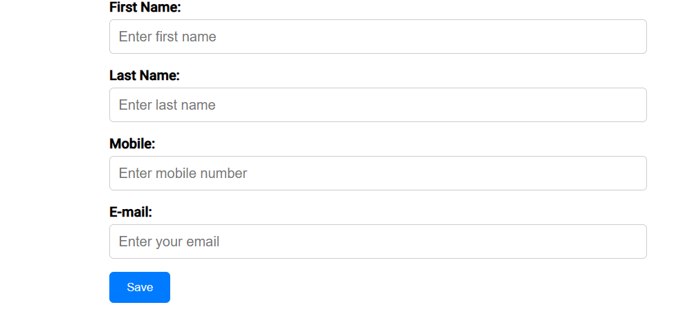
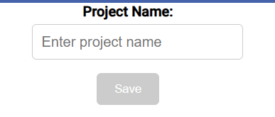
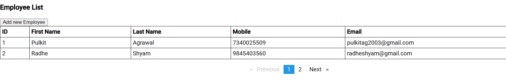
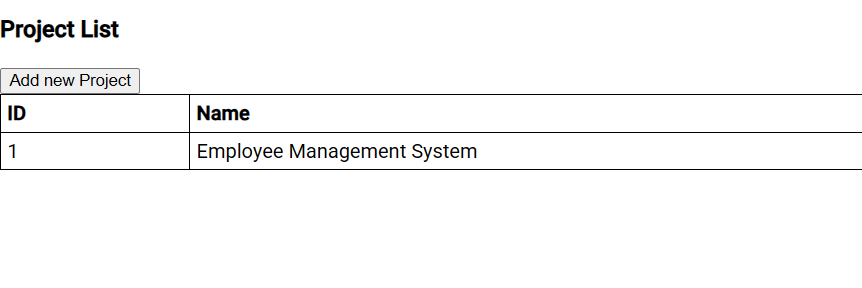

# Employee Management System

This is a full-stack application that allows you to manage employee details and projects. It consists of a backend built using Spring Boot and a frontend developed using Angular. The application also uses MySQL as the database to store employee and project data.

## Table of Contents
- [Technologies Used](#technologies-used)
- [Prerequisites](#prerequisites)
- [Setup Backend](#setup-backend)
- [Setup Frontend](#setup-frontend)
- [Run the Application](#run-the-application)
- [Database Setup](#database-setup)
- [Contributing](#contributing)

## Technologies Used

- **Backend:** Spring Boot, Java, MySQL
- **Frontend:** Angular, HTML, CSS
- **Database:** MySQL

## Prerequisites

1. Install [Java 8](https://www.oracle.com/java/technologies/javase-jdk8-downloads.html) or higher.
2. Install [MySQL](https://dev.mysql.com/downloads/installer/) and set up a MySQL database.
3. Install [Node.js and npm](https://nodejs.org/en/).
4. Install [Angular CLI](https://angular.io/cli) globally by running: 
   ```bash
   npm install -g @angular/cli
   ```
5. Install [Maven](https://maven.apache.org/) (if it's not already installed).

## Setup Backend

1. Clone the repository to your local machine:
   ```bash
   git clone https://github.com/your-username/EmployeeManagementSystem.git
   ```
2. Navigate to the backend directory:
   ```bash
   cd EmployeeManagementSystem/emp-management
   ```
3. Open `application.properties` and ensure the following configuration is correct:
   ```properties
   spring.datasource.url=jdbc:mysql://localhost:3306/employeemanagementsystem
   spring.datasource.username=root
   spring.datasource.password=root
   spring.datasource.driver-class-name=com.mysql.cj.jdbc.Driver
   spring.jpa.hibernate.ddl-auto=update
   spring.jpa.show-sql=true
   ```
4. Run the backend application using Maven:
   ```bash
   mvn spring-boot:run
   ```
   The backend server will start on `http://localhost:8080`.

## Setup Frontend

1. Navigate to the frontend directory:
   ```bash
   cd EmployeeManagementSystem/emp-management-frontend
   ```
2. Install the required npm packages:
   ```bash
   npm install
   ```
3. Start the Angular development server:
   ```bash
   ng serve
   ```
   The frontend will be available at `http://localhost:4200`.

## Run the Application

1. **Backend**: The backend application will be running on `http://localhost:8080`.
2. **Frontend**: The Angular application will be running on `http://localhost:4200`.

You can now interact with the Employee Management System through the frontend interface.

### **Database Setup**

Before running the application, you need to create a database for the application to connect to. The schema and tables will be created automatically by Spring Boot at runtime.

- **Create a Database**: Create a database in MySQL (or your preferred database) with the name of your choice (e.g., `employeemanagementsystem`).
  - Example SQL to create a database:
    ```sql
    CREATE DATABASE employeemanagementsystem;
    ```

- **Automatic Table Creation**: Spring Boot will automatically create the necessary tables based on the entity classes at runtime. No need to import or run any SQL file manually unless you want to insert initial data or define your schema.

- **Importing Data (Optional)**: If you want to insert sample data, you can use the `EmployeeManagementSystem.sql` file. Just place it in the `src/main/resources/` directory, and Spring Boot will run it on startup to populate your database.

  Example `EmployeeManagementSystem.sql`:
  ```sql
  -- Create tables if necessary (not required with auto table creation)
  CREATE TABLE IF NOT EXISTS employee (
      id BIGINT AUTO_INCREMENT PRIMARY KEY,
      firstname VARCHAR(100),
      lastname VARCHAR(100),
      mobile VARCHAR(15),
      email VARCHAR(100)
  );

  -- Insert sample data
  INSERT INTO employee (firstname, lastname, mobile, email) 
  VALUES ('John', 'Doe', '1234567890', 'john.doe@example.com');
  ```

With this setup, you only need to create the database manually. The application will take care of creating the tables and populating them (if you have an SQL file) at runtime.

--- 

## Screenshots

### Add Employee


### Add Project


### Employee List


### Project List


---
## Contributing

1. Fork this repository.
2. Create a new branch (`git checkout -b feature/your-feature`).
3. Commit your changes (`git commit -am 'Add new feature'`).
4. Push to the branch (`git push origin feature/your-feature`).
5. Open a pull request.
